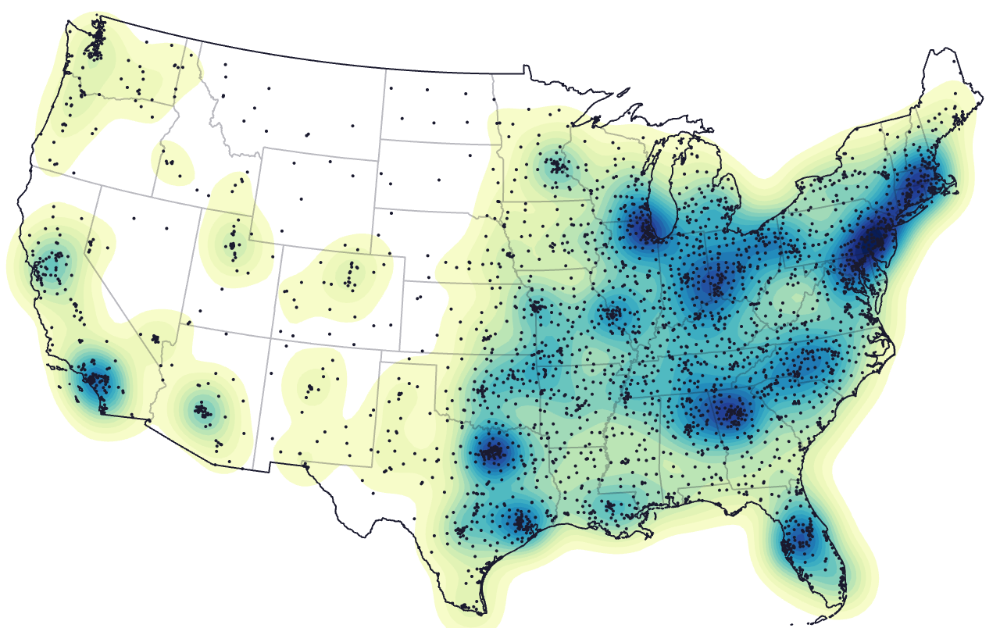
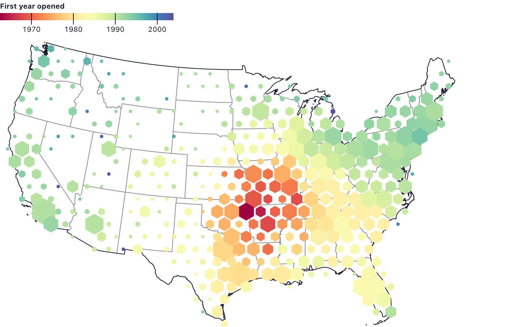
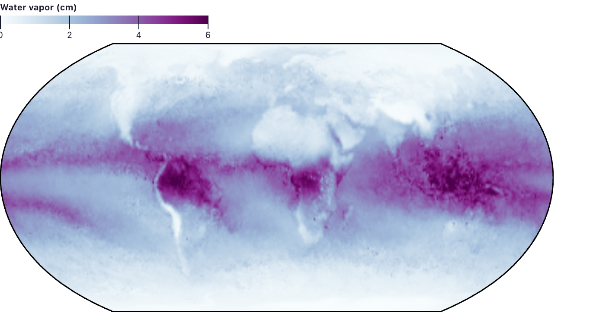
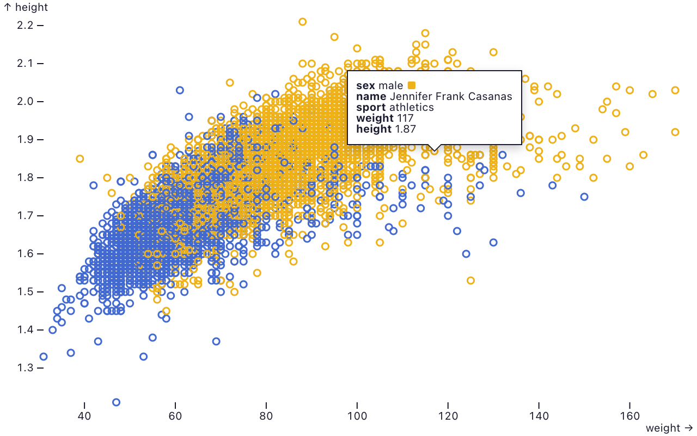
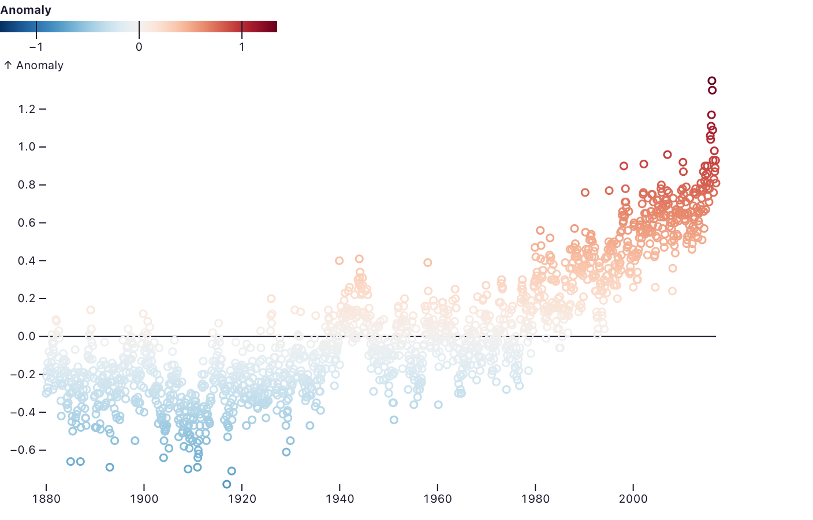
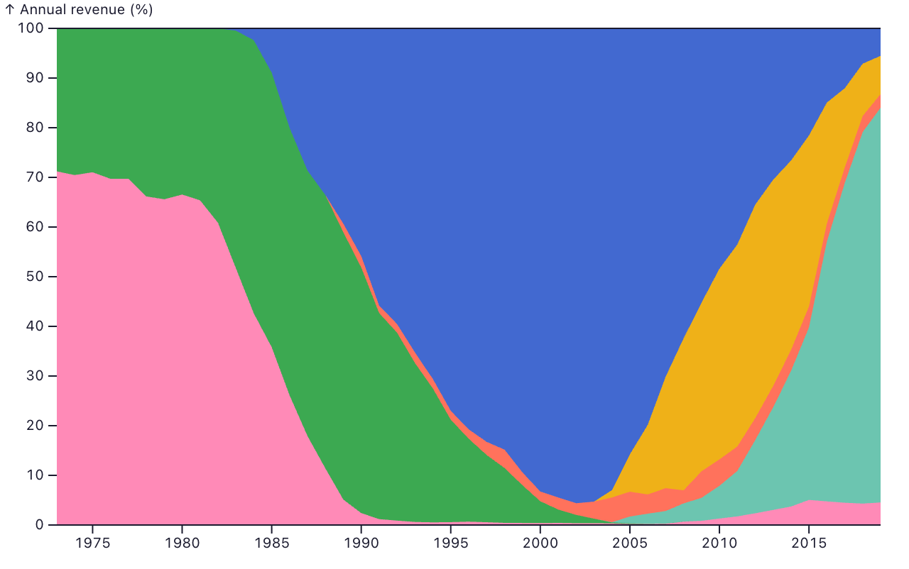
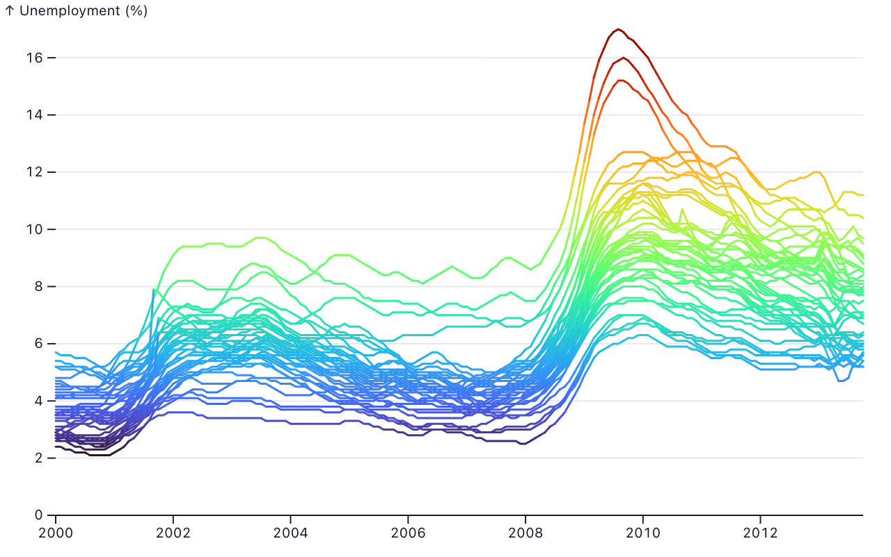
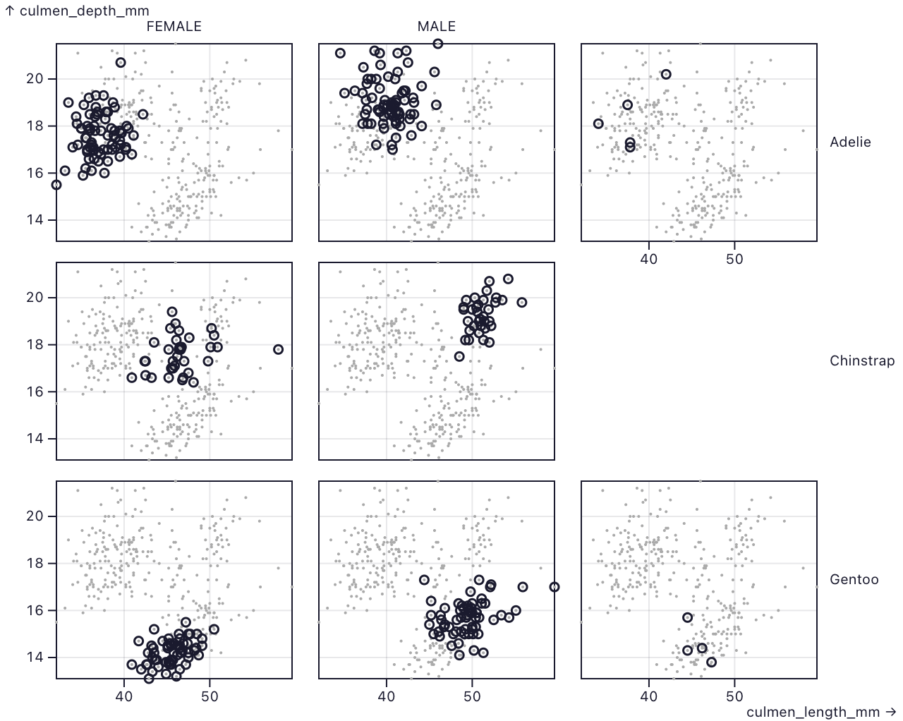
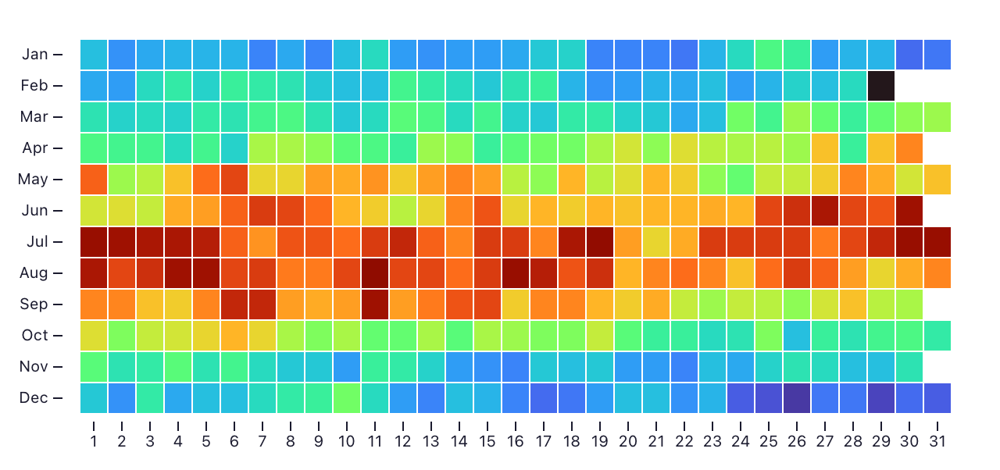

# Replot

**Replot** is a React component library for exploratory data visualization, based on [Observable Plot](https://observablehq.com/plot/). It provides a declarative JSX API featuring [scales](https://dave-hillier.github.io/replot/features/scales) and [layered marks](https://dave-hillier.github.io/replot/features/marks) in the *grammar of graphics* style.

**[Documentation and examples](https://dave-hillier.github.io/replot/)**

<table>
  <tr>
    <td><a href="https://dave-hillier.github.io/replot/marks/density"><br>Density</a></td>
    <td><a href="https://dave-hillier.github.io/replot/transforms/hexbin"><br>Hexbin</a></td>
    <td><a href="https://dave-hillier.github.io/replot/marks/raster"><br>Raster</a></td>
  </tr>
  <tr>
    <td><a href="https://dave-hillier.github.io/replot/features/interactions"><br>Tooltips</a></td>
    <td><a href="https://dave-hillier.github.io/replot/features/legends"><br>Legends</a></td>
    <td><a href="https://dave-hillier.github.io/replot/transforms/stack"><br>Stack</a></td>
  </tr>
  <tr>
    <td><a href="https://dave-hillier.github.io/replot/marks/line"><br>Line</a></td>
    <td><a href="https://dave-hillier.github.io/replot/features/facets"><br>Facets</a></td>
    <td><a href="https://dave-hillier.github.io/replot/marks/cell"><br>Cell</a></td>
  </tr>
</table>

Every chart above is JSX; follow a link to see its code.

---

## Motivation

D3's style and React's are actually convergent, even though the libraries are
incompatible. The data join — enter, update, exit — was declarative UI before
React existed: the DOM as a function of your data. React generalised the same
idea. They can't share a page because both want to own the DOM, so the usual
approach is to hide the chart behind a ref and a `useEffect` and rebuild it on
every data change. It works, but the chart is never really part of the React
app, and server-side rendering gives you an empty container.

Libraries like Recharts render natively in React, but they are built around
chart types. They're great for getting started and then inevitably
over-constrained: at some point the chart you want isn't one of the options.
Plot doesn't have that problem because it's a grammar — marks, scales, and
transforms that compose.

Plot gets described as a simplified D3, and it's incredible how good the
visualisations are despite that. The simplification is mostly good defaults —
scale inference, ticks, margins, legends — decisions D3 makes you take
yourself. That's why Replot ports Plot rather than just the DOM parts of D3:
porting the rendering alone would leave all those decisions to you again.

Replot keeps D3's math and Plot's scale and transform engine as they are, and
hands the rendering to React. Every mark is real JSX in the component tree, so
there is only one reconciler.

## React Component API

Use declarative JSX components to build charts natively in React applications:

```jsx
import {Replot, Dot, Line, AxisX, AxisY} from "@dave-hillier/replot/react";

function Chart({data}) {
  return (
    <Replot width={640} height={400}>
      <Dot data={data} x="weight" y="height" stroke="species" />
      <AxisX />
      <AxisY />
    </Replot>
  );
}
```

### Why Replot?

- **Native React integration** — Use composable React components (`<Replot>`, `<Dot>`, `<Line>`, etc.) that render directly into the React tree.
- **Declarative API** — Define charts with JSX, making them easier to read, compose, and maintain alongside other React code.
- **React ecosystem compatibility** — Works with React state, context, hooks, Suspense, and server rendering, where `renderToString` returns the whole plot. A hydrating client redraws it, because marks register with the plot from an effect.
- **No manual DOM management** — No need for refs, effects, or manual cleanup.
- **Built on Observable Plot** — All the power of Observable Plot's scales, transforms, and mark system.

### Design principles

Replot aims to translate Observable Plot's grammar into React idioms, not
merely rename its options:

- What Plot expresses by **wrapping** — transforms such as `binX`, `stackY`,
  `groupX` — is expressed by **nesting components**, so JSX structure
  mirrors the functional composition `binX(outputs, stackY(options))`:

  ```jsx
  <BinX y="count">
    <StackY>
      <RectY data={data} x="value" fill="sex" />
    </StackY>
  </BinX>
  ```

- What Plot expresses as **options** — channels like `x`/`y`/`fill`, styles,
  scale configuration — stays as **props**.
- Layered marks are sibling components, matching Plot's `marks: [...]` array.
- The functional transform form (`{...binX({y: "count"}, {x: "value"})}`)
  remains supported; both forms run the same transform functions and produce
  identical output.

See [PLAN.md](./PLAN.md) for the design rationale behind the transform
components.

### API overview

| Imperative API (Observable Plot) | React Component API (Replot) |
|---|---|
| `import * as Replot from "@dave-hillier/replot"` | `import {Replot, Dot} from "@dave-hillier/replot/react"` |
| `Replot.plot({ marks: [Replot.dot(data, {x, y})] })` | `<Replot><Dot data={data} x="x" y="y" /></Replot>` |
| Returns a detached SVG element | Renders directly into the React tree |
| Manual DOM insertion required | No refs or effects needed |

The core computation — D3 scales, shape generators, geo projections, data transforms (bin, stack, group, etc.), and channel/scale inference — is shared between both APIs.

### Examples

**Scatterplot with color encoding:**

```jsx
import {Replot, Dot} from "@dave-hillier/replot/react";

function Scatterplot({data}) {
  return (
    <Replot width={640} height={400} color={{scheme: "category10"}}>
      <Dot data={data} x="weight" y="height" fill="species" />
    </Replot>
  );
}
```

**Histogram with binning:**

```jsx
import {Replot, BarY, BinX, RuleY} from "@dave-hillier/replot/react";

function Histogram({data}) {
  return (
    <Replot>
      <BinX y="count">
        <BarY data={data} x="value" />
      </BinX>
      <RuleY data={[0]} />
    </Replot>
  );
}
```

**Line chart with grid and custom scales:**

```jsx
import {Replot, Line} from "@dave-hillier/replot/react";

function LineChart({data}) {
  return (
    <Replot y={{grid: true}} color={{scheme: "warm"}}>
      <Line data={data} x="date" y="temperature" stroke="city" />
    </Replot>
  );
}
```

**Faceted dot plot (small multiples):**

```jsx
import {Replot, Dot} from "@dave-hillier/replot/react";

function FacetedPlot({data}) {
  return (
    <Replot>
      <Dot data={data} x="x" y="y" fx="category" fill="group" />
    </Replot>
  );
}
```

**Stacked area chart:**

```jsx
import {Replot, AreaY, StackY} from "@dave-hillier/replot/react";

function StackedArea({data}) {
  return (
    <Replot>
      <StackY>
        <AreaY data={data} x="date" y="value" fill="category" />
      </StackY>
    </Replot>
  );
}
```

**Interactive chart with tooltips:**

```jsx
import {Replot, Dot} from "@dave-hillier/replot/react";

function InteractiveChart({data}) {
  return (
    <Replot>
      <Dot data={data} x="x" y="y" fill="species" tip />
    </Replot>
  );
}
```

---

## Getting started

```bash
npm install @dave-hillier/replot
```

Replot is published as a scoped package because the bare name `replot` is taken
on npm by an unrelated project. Replot is on 0.x while the API settles, so a
minor version can contain breaking changes; the [changelog](./CHANGELOG.md) lists
them.

Then import the React API:

```js
import {Replot, Dot, Line, BarY, AxisX, AxisY} from "@dave-hillier/replot/react";
```

Or the imperative API:

```js
import * as Replot from "@dave-hillier/replot";
```

The imperative API renders statically. `Replot.plot` returns a detached SVG
element and attaches no pointer listeners, so marks that depend on the pointer,
such as a `tip` or a `crosshair`, render with nothing selected, and the returned
element never gets a `.value` or a bubbling `input` event. Upstream Observable
Plot is interactive here. In Replot that behaviour belongs to the React API,
which mounts a real React root and reports the selection through the `onValue`
prop on `<Replot>`.

## Based on Observable Plot

Replot is a fork of [Observable Plot](https://observablehq.com/plot/), ported to provide a first-class React component API. The [Replot documentation](https://dave-hillier.github.io/replot/) covers scales, marks, transforms, and projections as JSX; the concepts are shared with Plot, so the [Observable Plot documentation](https://observablehq.com/plot/) and gallery are useful too.

## Contributing

See [CONTRIBUTING.md](./CONTRIBUTING.md).

## License

[ISC](./LICENSE)
